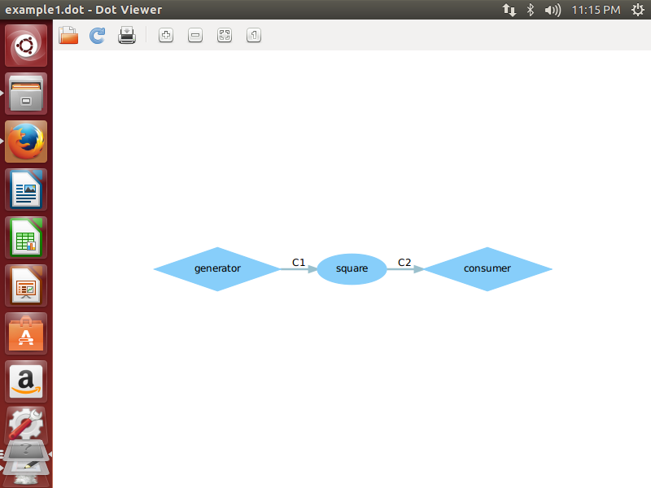
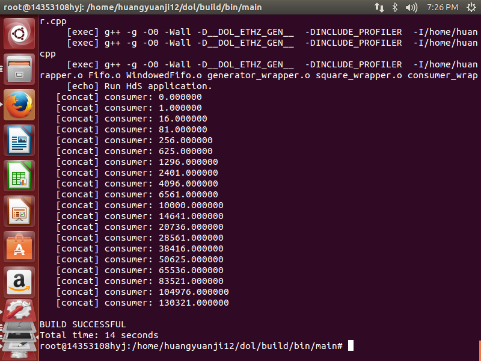
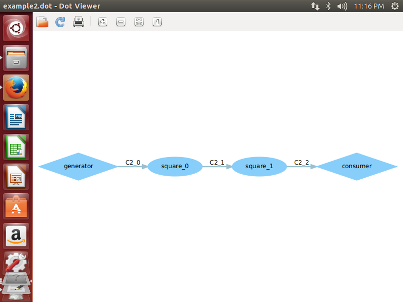
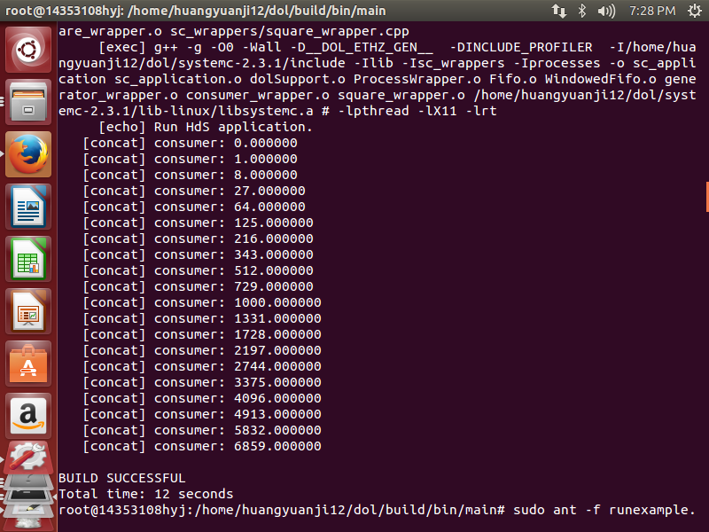

#Lab2：DOL 实例分析&编程

## 截图

example1截图：

example2截图：

## 修改内容
example1：
把square.c 中的 i=i*i改成i=i*i*i。
example2：
把example2.xml中的N值从3改成2。

##实验感想
本次实验是让我们初步理解dol编程中的生产者，消费者模块和对应的dot图，并自己动手修改了一些代码。比较坑的一点是编译完后要重新编译需要把原来文件给删除才能成功，
