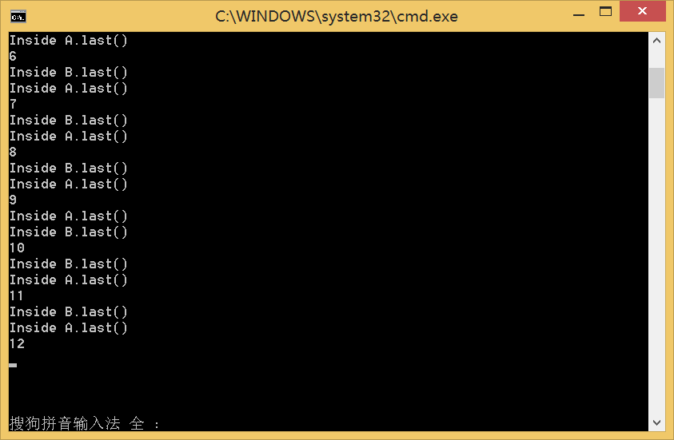

# 生成死锁 #

为了研究死锁发生条件，我们设计以下代码来人为制造死锁：
    
    class A{
    	synchronized void methodA(B b){
    		b.last();
    	}
    	synchronized void last(){
    		System.out.println("Inside A.last()");
    	}
    }
    class B{
    	synchronized void methodB(A a){
    		a.last();
    	}
    	synchronized void last(){
    		System.out.println("Inside B.last()");
    	}
    }
    class Deadlock implements Runnable{
    	A a = new A();
    	B b = new B();
    	Deadlock(){
    		Thread t = new Thread(this);
    		int count = 30000;
    		t.start();
    		while(count-->0);
    		a.methodA(b);
    	}
    	public void run(){
    		b.methodB(a);
    	}
    	public static void main(String args[]){
    		new Deadlock();
    	}
    }
    
A，B两个类都有一个synchronize方法methodA和methodB，在method中分别调用对方的synchronize方法last收敛创建了两个类A，B的实例a，b，主线程的t.start()把t加入到线程队列中，在主线程执行完毕后执行。然后主线程开始while循环，之后调用a的methodA方法，此时A中synchronize方法锁都被占用，methodA中调用了b.last()方法，正常情况下执行完last后释放B锁，再执行完rmethodB释放A锁，此时释放了所有锁后继续运行线程t中的methodB方法，流程同理。在正常情况下输出如图：

但是由于java线程调度是采用时间片调度，所以每个线程都有可能在运行到一半发生时间片耗尽的情况，如果我们调节count值就会达到这个效果：count越大，在while循环里消耗的时间就越多，分配给methodA的时间就越少。时间少会有两种情况：一种是在没开始执行就耗尽了时间片，导致t线程在主线程获得下一次时间片之前运行完毕，这样会导致如下图一样A，B输出顺序颠倒：

另外一种情况是时间片在执行methodA执行到一半的时候就耗尽了，此时主线程占用了A的synchronized方法的信号量，却没有执行下一步，这时跳到了t线程，t线程获得B方法的信号量调用methodB，结果发现A信号量被占用，于是t被阻塞，又到主线程被调度，自此形成了循环等待，形成死锁：

如上图，程序在第12次循环形成了死锁。
 
# 死锁形成的4个条件 #
1. 互斥条件：一个资源每次只能被一个进程使用。
2. 请求与保持条件：一个进程因请求资源而阻塞时，对已获得的资源保持不放。
3. 不剥夺条件：进程已获得的资源，在末使用完之前，不能强行剥夺。
4. 循环等待条件：若干进程之间形成一种头尾相接的循环等待资源关系。

