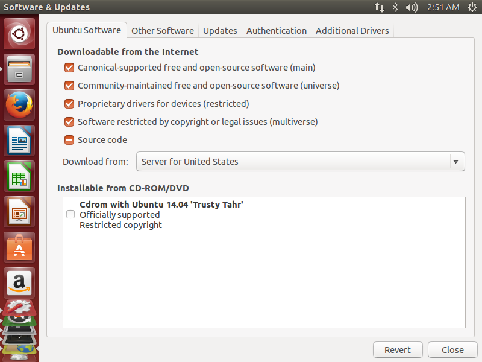
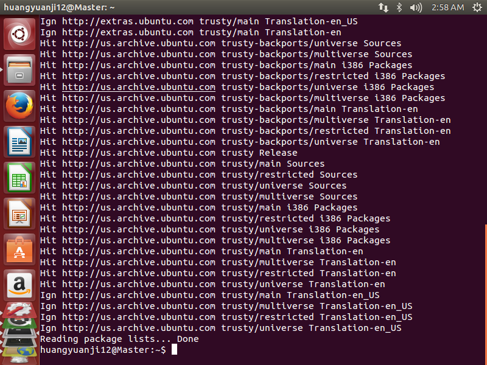
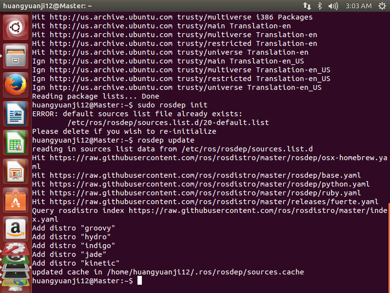
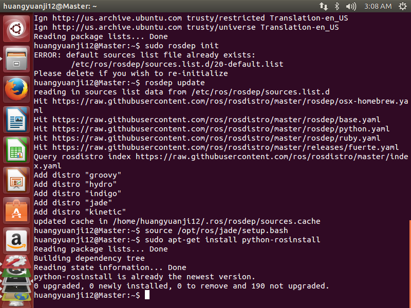
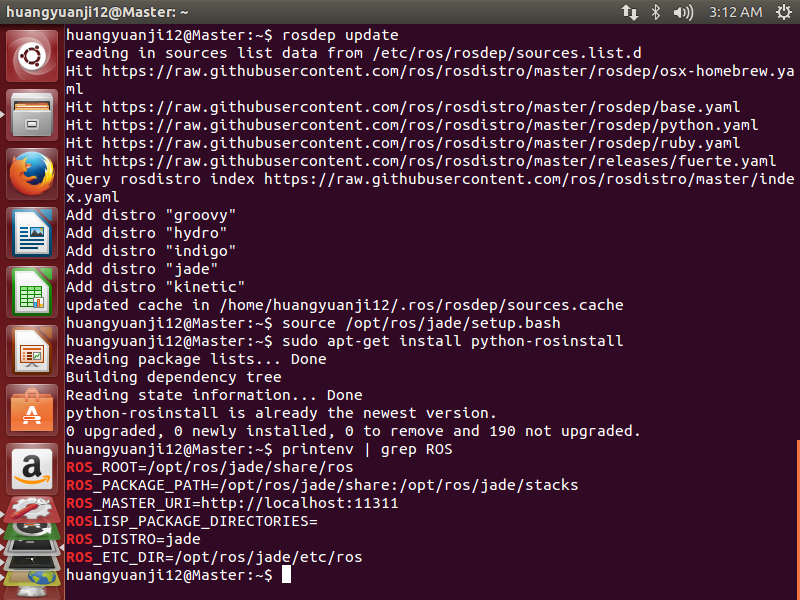
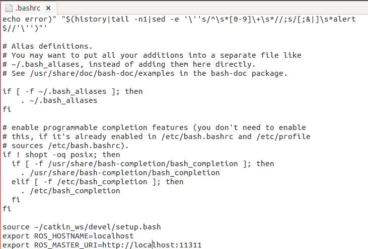
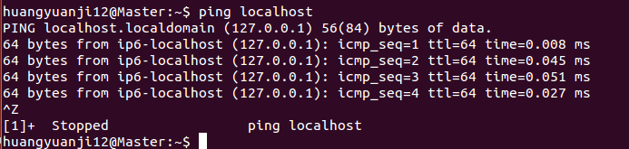
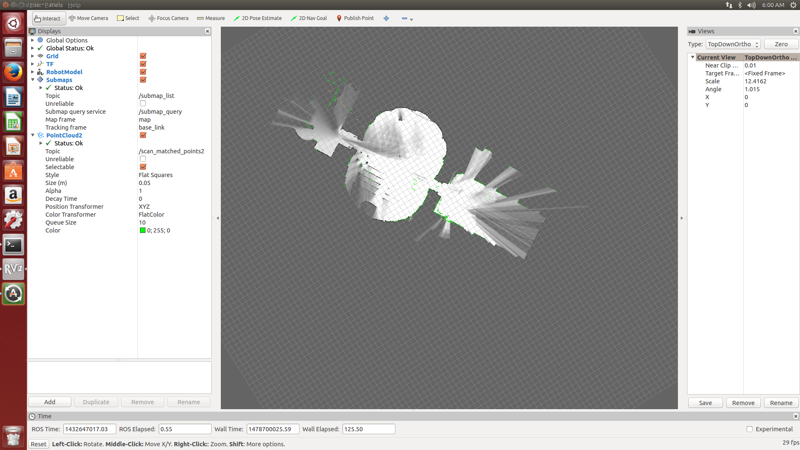

# Install ROS #
## 1. Configure Ubuntu repositories ##
Configure the Ubuntu repositories to allow "restricted," "universe," and "multiverse."

## 2. Setup your sources.list  ##

Setup the computer to accept software from packages.ros.org. ROS Jade ONLY supports Trusty (14.04), Utopic (14.10) and Vivid (15.04) for debian packages.

	sudo sh -c 'echo "deb http://packages.ros.org/ros/ubuntu $(lsb_release -sc) main" > /etc/apt/sources.list.
	d/ros-latest.list'

## 3. Set up your keys ##

	sudo apt-key adv --keyserver hkp://ha.pool.sks-keyservers.net:80 --recv-key 0xB01FA116

## 4. Installation  ##
First, make sure Debian package index is up-to-date:

	sudo apt-get update

Then we can start the ROS, full version is recommended to be download:

	sudo apt-get install ros-jade-desktop-full
## 5. init rosdep ##

Before you can use ROS, you will need to initialize rosdep. rosdep enables you to easily install system dependencies for source you want to compile and is required to run some core components in ROS.

	sudo rosdep init
	rosdep update
	

## 6. Environment setup ##

It's convenient if the ROS environment variables are automatically added to your bash session every time a new shell is launched:

	echo "source /opt/ros/jade/setup.bash" >> ~/.bashrc
	source ~/.bashrc

If you have more than one ROS distribution installed, ~/.bashrc must only source the setup.bash for the version you are currently using.

If you just want to change the environment of your current shell, you can type:

	source /opt/ros/jade/setup.bash

## 7. Getting rosinstall ##

rosinstall is a frequently used command-line tool in ROS that is distributed separately. It enables you to easily download many source trees for ROS packages with one command.

To install this tool on Ubuntu, run:

	sudo apt-get install python-rosinstall

Now the ROS has been installed, using the command to make sure that your enviroment has been properly setup:

	$ printenv | grep ROS	

#Install cartographer#

## 1. Install ceres solver-1.11.0 ##

Beacuse of the failure in installing ceres solver by the following command 

	catkin_make_isolated --install --use-ninja

We need to install the ceres solver in the very first from github:

	git clone https://github.com/hitcm/ceres-solver-1.11.0.git
	cd ceres-solver-1.11.0/build
	cmake ..
	make –j
	sudo make install

But during the installation, the system shutdown when using the command 

	make -j

so we use make instead of make -j

## 2. Install cartographer ##

In this step, we can also get the sourse code from github

	git clone https://github.com/hitcm/cartographer.git
	cd cartographer/build
	cmake .. -G Ninja
	ninja
	ninja test
	sudo ninja install

## 3. Install cartographer-ros ##

download the cartographer-ros in catkin_ws/src

	git clone https://github.com/hitcm/cartographer_ros.git

## 4. Running the demos ##

Now that Cartographer and Cartographer’s ROS integration are installed, download the example bags to a known location and run the demos.

	wget -P ~/Downloads https://storage.googleapis.com/cartographer-public-data/bags/backpack_2d/cartographer_paper_deutsches_museum.bag
	wget -P ~/Downloads https://storage.googleapis.com/cartographer-public-data/bags/backpack_3d/cartographer_3d_deutsches_museum.bag

Use the following commands to run the demos.

	roslaunch cartographer_ros demo_backpack_2d.launch bag_filename:=${HOME}/Downloads/cartographer_paper_deutsches_museum.bag
	roslaunch cartographer_ros demo_backpack_3d.launch bag_filename:=${HOME}/Downloads/cartographer_3d_deutsches_museum.bag

Before running demos, use the following command to modify localhost in the .bashrc using gedit.

	cd
	gedit ~/.bashrc

We need to confirm we can ping to localhost.

	ping localhost

Running the 2D demos

Finally we have installed the ROS and cartographer.