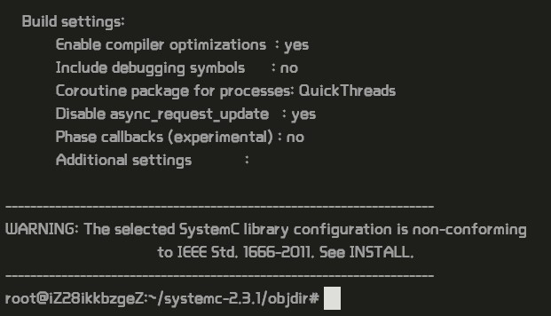
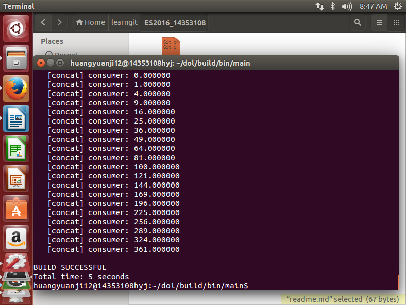

##Description
The distributed operation layer (DOL) is a framework that enables the (semi-) automatic
mapping of applications onto the multiprocessor SHAPES architecture platform. The DOL
consists of basically three parts:

*  DOL Application Programming Interface: The DOL defines a set of computation and
communication routines that enable the programming of distributed, parallel
applications for the SHAPES platform. Using these routines, application programmers
can write programs without having detailed knowledge about the underlying
architecture. In fact, these routines are subject to further refinement in the
hardware dependent software (HdS) layer.
* DOL Functional Simulation: To provide programmers a possibility to test their
applications, a functional simulation framework has been developed. Besides
functional verification of applications, this framework is used to obtain
performance parameters at the application level.
*  DOL Mapping Optimizati on: The goal of the DOL mapping optimization is to compute
a set of optimal mappings of an application onto the SHAPES architecture platform.
In a first step, XML based specification formats have been defined that allow to
describe the application and the architecture at an abstract level. Still, all the
information necessary to obtain accurate performance estimates is contained.

##How to install

* This section provides a guide how to set up the DOL on a computer. This guide leads through
the necessary steps, starting from the download of the DOL to the execution of an example
application using the DOL functional simulator. More detailed information is available
in the tool guide which is included in the DOL package.

We need to install the necessary environment.

     $    sudo apt-get update
     $	sudo apt-get install ant
     $ 	sudo apt-get install openjdk-7-jdk
     $	sudo apt-get install unzip

Unzip the systemc in new directory dol.

    $    mkdir dol
    $	unzip dol_ethz.zip -d dol
    $	tar -zxvf systemc-2.3.1.tgz

Compile systemc and run configure.

    $    cd systemc-2.3.1
    $	mkdir objdir
    $	cd objdir
    $	../configure CXX=g++ --disable-async-updates
    $    sudo make install
    $    pwd
    $    cd ../dol

Find the following sentence and change it.

    <property name="systemc.inc" value="YYY/include"/>
    <property name="systemc.lib" value="YYY/lib-linux/libsystemc.a"/>

Compile dol and get the result.

    $    ant -f build_zip.xml all
    $    cd build/bin/main
    $    sudo ant -f runexample.xml -Dnumber=1

##Experimental experience
安装过程下载所需文件和jdk用了很长时间，将近5个小时，接下来就是按部就班照实验文档往下做就可以，
要注意更改文件路径时要在文件夹中能找到对应文件，最重要的是最后一步测试时要在前面加sudo，否则
会报错。

